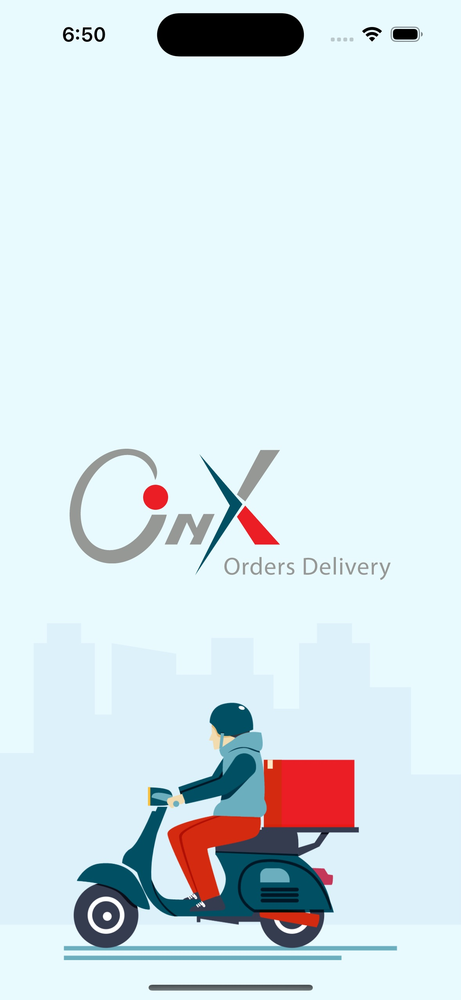
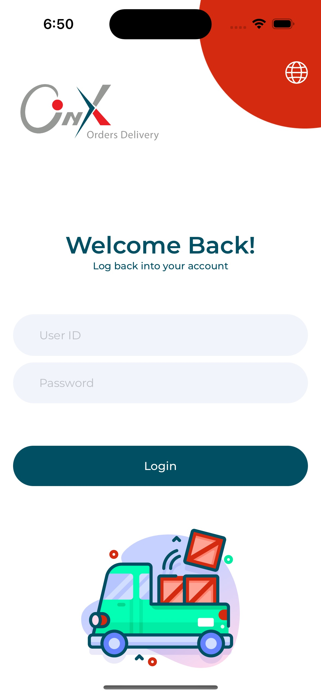
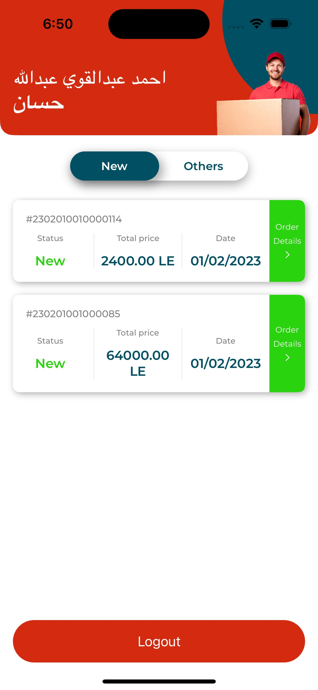
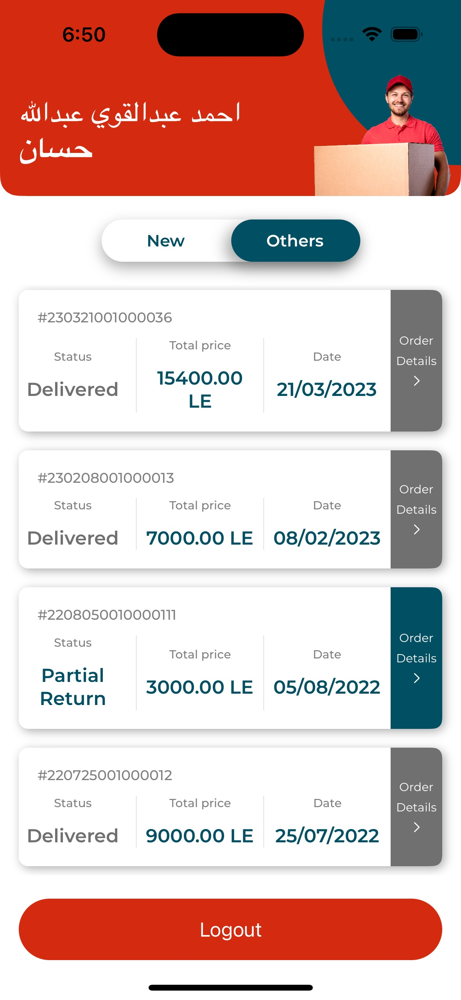
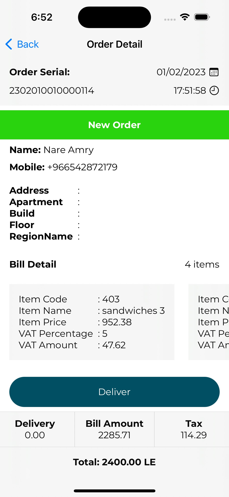

# Onyx Delivery

`Ultimate Solutions iOS Task`

This is an iOS app based on the provided design and APIs. It loads data from the API and stores it in a local SQLite database for filtering. The app is written in Swift and uses the MVVM architecture and Alamofire package for networking.

## Features

- Loads data from the provided API using `Alamofire`
- Stores data in a local SQLite database using the `SQLite` package
- Implements the `MVVM architecture` for clean separation of concerns
- Written using `Swift` and `SwiftUI`
- Automatically logs out the user after 2 minutes of inactivity

`The project was completed in less than 57 hours.`

### Demo Video

### Screenshots

| Splash Screen           | Login Page              |
|-------------------------|-------------------------|
|  |  |

| Home Page (New)         | Home Page (Others)      | Order Detail Page       |
|-------------------------|-------------------------|-------------------------|
|  |  |  |
